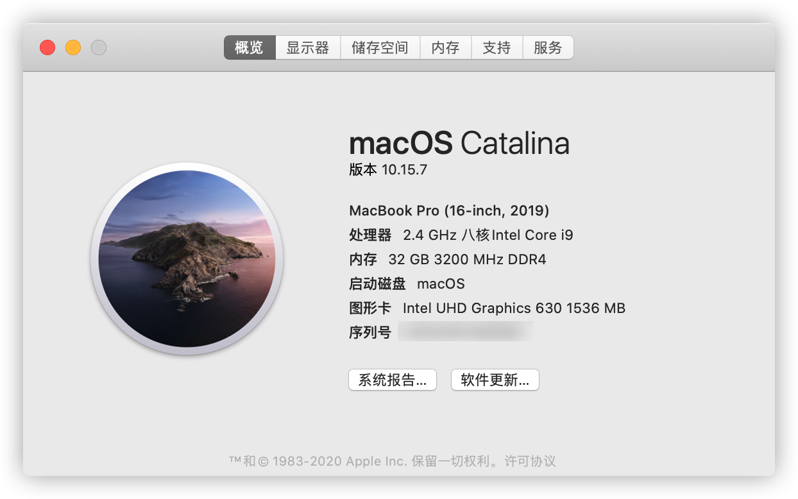

# hackintosh-dell-precision-7540-oc

dell precision-7540 oc hackintosh alc289 黑苹果配置文件

## 系统版本

`macOS Catalina` 10.15.7  `OpenCore`  6.2.0

## 主要配置 

### DELL PRECISION 7540

- CPU：Intel(R) Core(TM) i9-9980HK CPU @ 2.40GHz
- 集显：Intel UHD Graphics 630 (Mobile)
- 独显：Nvidia Quadro RTX 3000 ( 6 GB / 戴尔 )
- 主板：戴尔 0CYJDT ( CM246 芯片组 )
- 声卡：ALC289
- 板载网卡：I219-LM 
- 无线网卡&&蓝牙：AX200
- 读卡器：RTS5260
- BIOS版本：1.9.0
  - cfg lock 顺利解锁，`setup_var2 0x6ED 0`

## 正常工作

- 内建显示器正常
- 集成显卡正常
- 声卡正常
- 无线网卡正常（我用的itlwm，测试airportitlwm也正常）
  - 显示网速可以用LittleSnitch
- 有线网卡正常
- 蓝牙正常
- 睡眠唤醒正常
- 热键控制亮度（F11,F12，因为Fn+UP/down无法找到键值）
- 摄像头正常
- 触控板正常（GPIO驱动，支持手势）
- 键盘正常
- 电池正常

## 存在问题

- ~~插耳机有杂音~~
- 雷电扩展坞无设备，未测试
- ~~只能雷电口外接显示器，目前内建显示器和外接显示器只能驱动一个~~
  - ~~驱动外接显示器办法：关机合盖开机，进桌面后可以开盖~~
- ~~开机后BIOS里的`enable switchable graphics`会重置为未勾选（这样会屏蔽集显）~~
  - ~~已自己写了个hot patch解决~~

## 不工作

- 独显不能驱动
- 读卡器不能驱动
- 后面HDMI口和miniDP口由独显驱动，故无法外接显示器

***

2020年11月17日 

1. 解决hdmi输出无声音的问题
2. 适配big sur ，但我还是用catalina（itlwm和音频驱动还是用的catalina的）

2020年11月15日 

1. 升级OC到6.3
2. 更换了`SMBIOS`到`MacBookPro16,3`，现在原生支持`uhd630`显卡及外接显示器了

2020年10月28日 

解决TYPE-C外接显示器无输入的问题

http://bbs.pcbeta.com/viewthread-1834012-1-2.html

2020年10月26日   

更新APPLEALC.Kext为这个大佬编译的版本，现在耳机已无破音了。

https://www.tonymacx86.com/threads/solved-appleacl-microphone-not-working-alc289.297349/post-2121229

***

